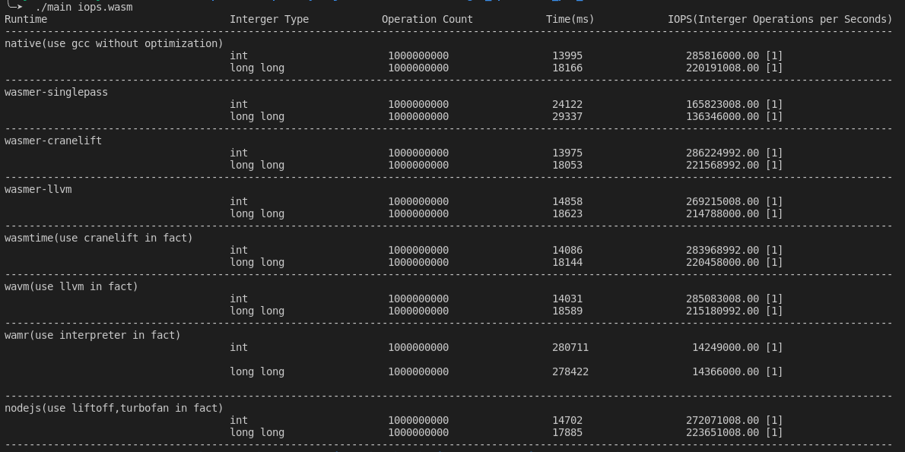

# A Benchmark for IOPS(Interger Operations per Second) in WebAssembly Runtimes
对WebAssembly程序在WebAssembly Runtime/虚拟机内的整数操作性能进行测试。

## Runtimes
被测试的WebAssembly Runtime包括：
- [wasmer](https://github.com/wasmerio/wasmer) (v2.0)
- [wasmtime](https://github.com/bytecodealliance/wasmtime) (v0.36.0) 
- [wavm](https://github.com/WAVM/WAVM) (v0.0.0-prerelease)
- [wamr](https://github.com/bytecodealliance/wasm-micro-runtime) (iwasm vWAMR-01-18-2022)
- [nodejs](https://nodejs.org/) (v16.15.0)

此外，将经由GCC编译（无优化参数）的Native代码作为比较基准。

## 编译情况
使用C编写被测试程序，然后利用Clang和LLVM将其编译为wasm程序（target: wasm32-wasi），编译过程中加入wasi-sdk以使wasm程序可调用系统接口。

使用GCC将被测试程序编译（无优化参数）为基准Native程序

对于wamser和wasmtime，由于官方命令行工具功能无法满足测试需求，故基于Rust并使用相应的依赖包来编译构建自定义命令行工具。

对于wavm直接下载使用官方命令行工具

对于wamr(wasm-micro-runtime)，下载其源码后编译使用其[虚拟机核心iwasm](https://github.com/bytecodealliance/wasm-micro-runtime/blob/main/README.md#iwasm-vm-core)

## 测试环境
- hardware： Intel(R) Core(TM) i7-6700 CPU @ 3.40GHz, 4 cores, X86_64
- os: Arch Linux 5.17.7-arch1-1
- compilers: 
  - gcc: version 12.1.0 (GCC)
  - clang: v13.0.1
  - llvm: v13.0.1-2
  - wasi-sdk: v15.0
## 测试结果

